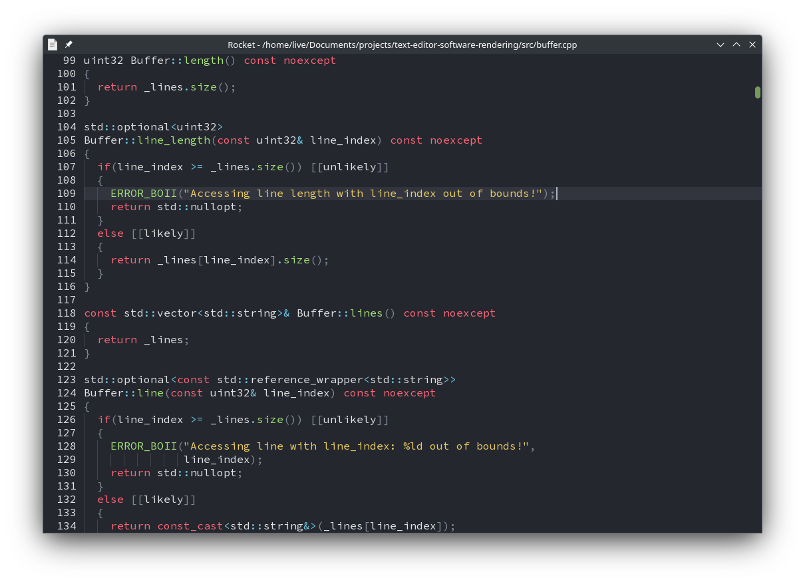

# Text Editor - Software Rendering
A test project to check the performance and memory usage of simple text editor with software rendering in SDL2 with help of Cairo.



### Building
- Windows:
  ```powershell
  .\scripts\windows\gen_makefiles.bat
  .\scripts\windows\build_and_run_release.bat
  ```
- Linux:
  ```fish
  chmod +x ./scripts/linux/*.sh
  ./scripts/linux/gen_makefiles.sh
  ./scripts/linux/build_and_run_release.sh
  ```
- macOS:
  🚧 WIP

### Building Distrubutable
- Windows:
  ```powershell
  .\scripts\windows\gen_makefiles.bat
  .\scripts\windows\build_distributable.bat
  ```
- Linux:
  🚧 WIP
- macOS:
  🚧 WIP
